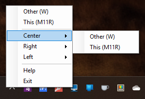

# MonitorInputSwitcher
Highly opinionated way to switch monitor input



## Download

https://apps.neptuo.com/monitor-input-switcher/

## Example configuration

Having three monitors
- 0 named "Center"
- 1 named "Right"
- 2 named "Left"

```json
{
  "Version": 2,
  "Monitors": {
    "0": "Center",
    "1": "Right",
    "2": "Left"
  },
  "Computers": {
    "M11R": {
        "Center": 1,
        "Left": 1,
        "Right": 1
    },
    "W": {
        "Center": 2,
        "Left": 2,
        "Right": 2
    }
  }
}
```